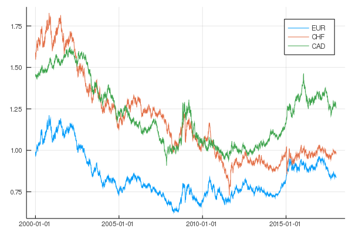

# CurrencyAPI.jl



`CurrencyAPI.jl` offers the possibility to access the [Foreign exchange rates API](https://exchangeratesapi.io/) in Julia.

## Installation

```@julia
#add CurrencyAPI # not (yet?) supported
```

or

```@julia
add https://github.com/markushhh/CurrencyAPI.jl/
```

## Index

The package contains following functions: 

- `get_symbols`
- `cconvert`

## Tutorial and Workflow

Download a dataset

```@julia
x1 = get_symbols("USD", "CAD", "2000-01-01", "2018-01-01")
x2 = get_symbols("USD", ["EUR", "CHF", "CAD"], "2000-01-01", "2018-01-01")
```

```@julia
plot(x2)
```


convert Euros into another currency.

```@julia
cconvert(100, "CAD")
```
```
144.98
```


# Each comment, suggestion or pull request is welcome!
